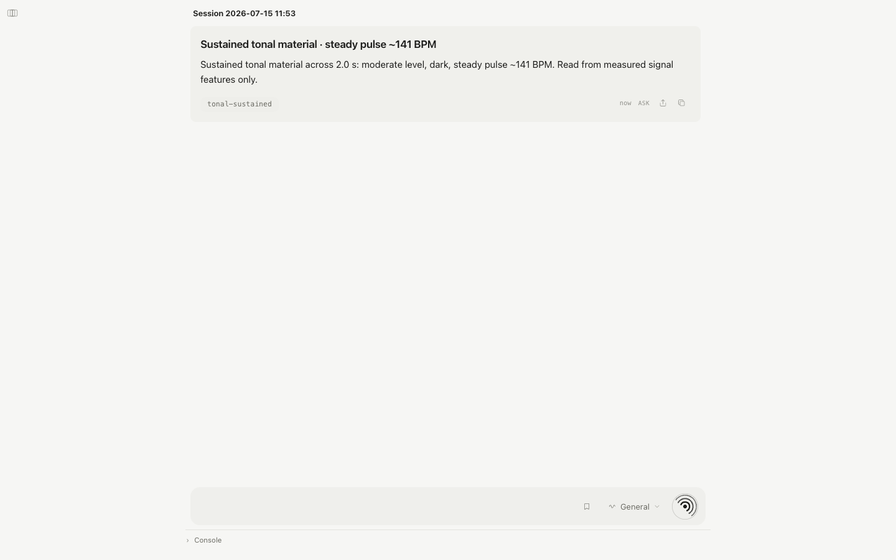

# oída

> **Public alpha · Open research release · Local-first · Open-source · Under active development**

Oída is a local listening instrument and agentic gateway for sound files,
microphones, and system audio. It combines deterministic signal analysis with
optional audio models, keeps observation separate from interpretation, and can
remember a listening only when asked. A sound can enter Oída, become an
inspectable listening event, enter Akousmata as memory, and be heard again
without erasing the earlier account. When separately enabled, GERM can receive
an explicit sound, prompt, or lineage handoff for cultivation.

Oída's owned model path is developed and tested first with the open-source
MOSS-Audio Instruct and Thinking checkpoints. Those local models are the
recommended starting point for model-backed exploration. The gateway contract
remains model-agnostic, the deterministic path needs no model, and hosted
providers are never enabled by default.



## Try It Without a Model

The public-alpha path needs no model weights or GPU:

```bash
uv sync --extra dev
uv run oida serve --profile stub
```

Open `http://127.0.0.1:8765`, choose a WAV file, and begin with **Signal**.
Install `ffmpeg` to use non-WAV files or browser recordings. The stub profile
still performs deterministic DSP; it does not invent a semantic caption.

## What You Can Do

- Listen to files, microphone input, or macOS system output through the web
  dashboard, CLI, REST gateway, MCP server, or native macOS shell.
- Choose a bounded route for general, signal, field, music, voice, recall,
  remember, or deep listening.
- Inspect heard, measured, inferred, interpreted, speculative, and
  undetermined claims separately.
- Treat `heard` as an attributable human listening-pass report; model
  transcripts, events, and captions remain inferred or interpreted, while DSP
  output remains measured.
- Inspect the listening position, actual apertures, auditory scale, evidence
  sources, participants, temporal listening passes, provenance and cuts, route
  decisions, honest absences, and action authority that situate every result.
- Discuss a listening event with a deterministic local reasoner or an
  explicitly enabled model provider while keeping the original event fixed.
- Remember, compare, export, or forget selected events; optionally hand sound,
  prompt, or lineage to GERM when that component is enabled.

## Requirements

| Path | Operating system | Hardware and software |
| --- | --- | --- |
| Model-free service | macOS or Linux | Python 3.12+, `uv`; CPU only; `ffmpeg` for non-WAV input and browser recording |
| Embedded MOSS-Audio 4B | Apple Silicon macOS | Local MOSS-Audio code and weights, PyTorch/MPS; 16 GB minimum and 24 GB unified memory suggested |
| Embedded MOSS-Audio 8B | Apple Silicon macOS | Local MOSS-Audio code and weights; 24 GB minimum and 48 GB unified memory suggested |
| CUDA service | Operator-managed Linux/NVIDIA host | A separately running compatible MOSS-Audio SGLang endpoint |
| Native shell and system audio | macOS 13+ | Swift 5.9/Xcode command-line tools; Screen Recording permission for system output |

Windows is not part of the current tested release matrix. Model memory varies
by checkpoint and runtime; the dashboard reports estimates and compatibility
instead of promising one universal RAM minimum.

## Release Guide

| Question | Where to begin |
| --- | --- |
| How does it work? | [Architecture](docs/architecture.md) and [gateway contract](docs/gateway-contract.md) |
| Where do I define the ear's perspective? | [`LISTENING.md` and the harness](docs/listening-identity.md) |
| How does it connect? | [The Listening Stack](https://sonicfield.org/stack) and [GERM handoff](#stack-compatibility) |
| How do I install the tested models? | [MOSS-Audio setup](docs/model-setup.md) |
| Which models and licenses apply? | [Models and licensing](docs/models-and-licensing.md) |
| What is unfinished? | [Known limitations](#known-limitations) and [roadmap](ROADMAP.md) |
| How can I help? | [Contribution guide](CONTRIBUTING.md) |
| How should I cite it? | [CITATION.cff](CITATION.cff) |

The public Python distribution is `sonicfield-oida`; the import package and
commands remain `oida`, `oida-daemon`, and `oida-mcp`. The shorter `oida`
distribution name on PyPI belongs to an unrelated project.

Oída brings the AKOÚŌ listening contract, Earworm provenance protocol, and
Akousmata library behind one agent, CLI, gateway, and install. It can listen
through an optional local engine, including MOSS-Audio plus deterministic DSP,
or harness perception supplied by an audio-capable host. Both paths produce
the same accountable claim structure and optional durable memory. A separate
reasoning layer can discuss those results without rewriting what was heard.

This project was previously named **AEAR**, then **hmm**; it is now **oída**.
The Python package and primary CLI are `oida`; `hmm` and `aear` remain as
backward-compatible command aliases, and every setting reads `OIDA_*` first
with `HMM_*`/`AEAR_*` honored as fallbacks. UI copy uses the accented display
name **oída**.

## What Is Implemented

- **Unified gateway contract** (`oida/gateway/v0.5`) with two honest perception
  paths: Oída-owned audio through `POST /gateway/listen`, and host-owned model
  perception through `POST /gateway/harness`. `GET /gateway` advertises the
  installed AKOÚŌ, Earworm, and Akousmata contracts; `GET
  /gateway/schema/host-perception`, `/gateway/schema/listening-event`,
  `/gateway/schema/listening-context`, and `/gateway/schema/route-outcome`
  publish the integration boundaries while
  leaving AKOÚŌ as the semantic owner of listening context.
- **Decision-first refusal**: a covenant or input gate that closes before
  perception returns a complete `oida/route-outcome/v0.1` receipt without
  fabricating a listening event, audio asset, or acoustic claim. The
  decision-only Akousma is retained only when explicitly requested.
- **One lifecycle**: `oida start` ensures a singleton background gateway,
  `oida agent` starts it and opens the listening agent, and every stdio MCP
  adapter can ensure/reuse that gateway itself. The same process serves the
  dashboard, REST API, streamable HTTP MCP at `/mcp`, and the complete
  Akousmata navigator at `/library/`.
- **Local host integrations** installed by `oida integrate`: Hermes, Codex,
  Claude, OpenClaw, and OpenCode. Their generated MCP configs are pinned to the active Oída
  runtime, so they do not depend on shell `PATH` or require a second app. Host
  adapters start the gateway without prewarming MOSS; the host-perception path
  stays lightweight until Oída-owned listening actually needs the local model.
- **Remote capture surface** at `/remote`: the daemon serves a responsive
  past/future microphone UI, while network publication and HTTPS termination
  remain outside this repository and under the operator's control.
- FastAPI daemon (default `127.0.0.1:8765`) with task endpoints
  (`/transcribe`, `/events`, `/caption`, `/speech`, `/music`, `/qa`, `/think`,
  `/report`), the listening-event pipeline (`/listen-event`,
  `/listen-event/rerun`), background runtime, SSE state stream, memory,
  conversation, generation, and bridge routes. `GET /api` lists everything.
- Engine profiles: **`mac-mps`** (default; MOSS-Audio-4B on Apple Silicon,
  background prewarm, hot-swappable Instruct/Thinking), **`cuda-server`**
  (SGLang endpoint), and **`stub`** (no model; DSP still listens). Long audio
  is chunked at 45 s per mac-mps pass with overlap dedupe and a
  decode-degeneracy guard that discards token-soup output.
- Deterministic **signal listener**: DSP-only classification (silence /
  speech-like / music-like / tonal / percussive / noise / ambient) with honest
  captions — without a model the evidence level stays `measured_signal`.
- Python DSP: peak/RMS/crest, BS.1770-style LUFS/LRA, silence/clipping,
  zero-crossing, centroid/rolloff/flatness, band energy, onsets/BPM candidate,
  stereo correlation/width/balance. One inspection per file per listen (results
  are memoized on path+mtime).
- **Route presets** scope the MOSS passes: General (id `basic`; one caption
  pass), Signal (DSP-only, instant), Field, Music, Voice, Recall (read-only
  memory comparison), Remember (memory comparison + registration into the
  shared akousmata, AKOÚŌ `/remember`), and Deep (the full report). Preset ids follow
  AKOÚŌ v0.9's portable preset vocabulary (pre-v0.6 ids `environment`/`speech`/
  `memory` still resolve as aliases). Presets come from the AKOÚŌ skill
  registry (`/akouo/skills`) and the dashboard skill manager can deviate per
  listen.
- **Akousmata memory**: remember/list/search/similar/export/forget over local
  JSON traces with deterministic DSP similarity — and every Remember also
  files the listen as an **akousma** in the shared store, so the dashboard's
  Memory rail navigates one library (rename and forget there never delete the
  referenced audio). New records include an Earworm `auditum`: attributable
  report namespaces, temporal passes, provenance, preserved disagreement,
  attributed absence, route decisions, scoped actions, and receipts. Here
  “tokenized” means structured and addressable, never a
  financial token.
- **Listening sessions**: results group into daemon-owned sessions shared by
  every surface — dashboard, floating listener, hotkeys, MCP, and agents file
  into the same active session. `/sessions` covers create/activate/rename/
  archive/restore/delete plus per-result rename/delete and batch remember;
  history persists across restarts, and deleting history removes derived
  references only, never raw audio.
- **Optional GERM handoff** (shared Akousmata store): when GERM is configured,
  three explicit actions after a listen —
  *Sound*, *Prompt*, *Lineage* — persist the listen as an **akousma** in the
  configured store (`AKOUSMATA_PATH`, via Earworm's `py-akousma`) and
  deep-link GERM's `/import` route at the explicitly configured
  `OIDA_GERM_URL`. Without that setting, Oída exposes no handoff target and
  returns `409` rather than inventing a local installation.
  Opt-in song identification (`OIDA_SONGID=1`, ShazamIO) enriches the record's
  `extensions.songid`.
- **Sonic Field bridge**: "Explore in the wiki" searches the configured wiki,
  topics, journal, library, paths, research, notes, and labs for related
  concepts, with taxonomy alias normalization and Finder reveal.
- Event-grounded **conversation** (`/conversation/ask`): Oída composes the
  system prompt and covenant-filtered evidence packet, validates a cited
  structured response, and keeps the listening event immutable. Conversation
  can use deterministic local reasoning, Ollama, a user-supplied
  OpenAI-compatible endpoint, Google Gemini, Alibaba Qwen, NVIDIA NIM,
  OpenRouter, or an explicitly enabled Codex, Claude, Hermes, OpenClaw, or
  OpenCode host. Invalid or failed provider output gets one repair attempt,
  then a visible deterministic local fallback.
- **`LISTENING.md` listening identity**: one empty-by-default, local Markdown
  file in Oída's data directory can orient how model-backed interpretive
  listening and grounded dialogue attend, relate, speak, and ask. The shared
  dashboard edits it under Settings → Listening. It remains subordinate to
  evidence, privacy, AKOÚŌ routes, and Covenants; DSP and exact transcription
  stay literal. Every event carries a content-free identity revision and
  application state; hosted ears declare the revision they actually used
  through `oida/host-perception/v0.4`. See [the harness
  contract](docs/listening-identity.md).
- **Model roles and conversation profiles** in the shared dashboard: assign
  separate providers/models to fast perception, deep perception, transcription,
  music analysis, conversation, and targeted re-listening; shape tone, depth,
  initiative, focus, language, and bounded custom instructions without
  overriding evidence or privacy rules. The same panel reports physical RAM,
  estimated peak model memory, runtime compatibility, and untested targets.
  A conversation stays anchored to one event, with up to three comparison
  events added explicitly.
- **Local targeted re-listening**: a reasoner may request at most one focused
  MOSS/audio pass per turn when the original local audio is available and the
  covenant permits it. The new observation is disclosed as derived evidence;
  the original listening result is never changed.
- Prompt-only **generation bridge** (`/generation/*`): derives editable
  creation prompts from listening events; audio rendering is delegated to
  optional adapters, and `relisten` compares generated audio back to source.
- **Web dashboard** served by the daemon at `/`: one Listen surface (System /
  Mic / File with past/future direction), the session feed in the center
  (inline rename, tag filters, per-result actions), claims rendered by AKOÚŌ
  category with a sonogram + frequency-energy view of the measured layer,
  opt-in per-listen **Music ID** in Music mode, the Rules (covenant) control,
  light/dark appearance, an activity console, and shared-store memory search.
  Every surface syncs over `/events/stream` (SSE).
- **Native macOS shell** (`apps/macos`, SwiftPM): menu bar extra, a control
  center that embeds the same daemon-served dashboard (WKWebView — web and app
  cannot diverge) behind native titlebar chrome (sidebar toggles, source
  popovers, settings), daemon supervision (a managed daemon stops with the
  app), ScreenCaptureKit system-output tap with permission preflight, and the
  **floating listener** — a borderless, transparent, always-on-top
  listening-result box with a small reactive waveform, an in-place editable
  result title, and share/copy actions; its controls float just outside the
  box and appear on hover. Global hotkeys default to ⌃⌥L (summon the
  listener and listen) and ⌃⌥H (summon it without starting a listen).
- CLI (`oida listen/live/background/memory/chat/sweep/corpus-qa/bench`), `ear`
  and `akoe` helper CLIs, and an official MCP server exposing compact
  `oida_*` listening, harness, memory, and live tools (legacy aliases kept on
  the HTTP compatibility surface).
- A dependency-light test suite that runs without model weights.

## Stack compatibility

**Oída hears. AKOÚŌ structures and routes. Earworm addresses and traces.
Akousmata renders memory. GERM can cultivate.** The first four form the core
[Listening Stack](https://sonicfield.org/stack); GERM is an optional adjacent
component for explicit cultivation handoffs.

| Component | Version / contract | Role in OÍDA |
| --- | --- | --- |
| [AKOÚŌ](https://github.com/sonicfieldlabs/akouo) | `akouo-contract 0.9.1` / `akouo/v0.9` | Listening vocabulary, embodied heard boundary, attributed text boundaries, provenance, temporal passes, route decisions, corpus listening, covenants, and sovereign mode. |
| [Earworm / Akousma](https://github.com/sonicfieldlabs/earworm) | `akousma 0.6.1` / spec v1.5 | Addressable auditums, decision-only records, provenance, lineage, attributable disagreement resolution, attributed absence, forgetting receipts, and additive revision. |
| [Akousmata](https://github.com/sonicfieldlabs/akousmata) | `akousmata 0.6.1` | Embedded library at `/library/`, accountable-memory audit, decision and forgetting views, and the shared durable store. |
| OÍDA gateway | `sonicfield-oida 0.9.2` / `oida/gateway/v0.5` | Unified REST, MCP, agent, dashboard, local perception, host perception v0.4, listening events v0.3, and route outcomes. |
| [GERM](https://github.com/sonicfieldlabs/germ) | 0.3.3 optional integration | Explicit sound, prompt, and lineage handoff when separately installed and enabled. |
| [Algophony](https://github.com/sonicfieldlabs/algophony) | 0.5.2 integration | Batch evaluation can consume the same AKOÚŌ reports and Earworm context. |
| [ORAM](https://github.com/sonicfieldlabs/oram) | 0.4.1 | ORAM recordings and exports can be listened and remembered through the normal file surface; no special adapter is required. |

## Quick Start

For a guided Oída or complete Listening Stack installation, including host
checks, model choices, storage guidance, downloads, and optional agent
integrations, use the separate installer:

```bash
curl -fsSL https://raw.githubusercontent.com/sonicfieldlabs/listening-stack/main/install.sh | bash
```

Install the **core stack** and optionally add **GERM** in the terminal
assistant. Oída remains
in this repository; the installer only coordinates its source, dependencies,
models, and local configuration.

Prerequisites: Python 3.12+, `uv`, and `ffmpeg` for non-WAV uploads or browser
recordings. From this source workspace, one sync installs Oída together with
the canonical AKOÚŌ, Earworm/akousma, and Akousmata packages:

```bash
uv sync --extra dev
```

Start the model-free service first. Add the `moss` extra only when installing
the separately obtained local MOSS-Audio runtime and weights.

```bash
uv run oida serve --profile stub
uv sync --extra dev --extra moss       # optional embedded MOSS-Audio route
```

The singleton commands can then open the agent or library:

```bash
uv run oida start                         # add --profile stub for model-free use
uv run oida agent
uv run oida agent --library
```

`oida` or `oida serve` still runs the same system in the foreground. The local
dashboard is `http://127.0.0.1:8765`, the library is `/library/`, REST gateway
discovery is `/gateway`, and streamable HTTP MCP is `/mcp`.

Install the local adapters (each host can then start/reuse Oída automatically):

```bash
uv run oida integrate hermes
uv run oida integrate codex
uv run oida integrate claude
uv run oida integrate openclaw
uv run oida integrate opencode
uv run oida doctor
```

The `/remote` page is the dedicated remote ear: past/future capture with an
on-device ring buffer, optional consent-scoped location, and the akousma
(sound plus listening record) filed into the shared store by the server. OÍDA
does not configure remote-network access; see
`integrations/remote/README.md` for the runtime boundary.

Every listen surface can run under a **listening covenant** — the sovereignty
layer (v0.4, AKOÚŌ v0.7). A covenant is a plain-text declaration (English or
Spanish) of what this ear will not listen to, will release after hearing,
will not reveal, will not retain, will blur, or will refuse at certain hours;
rules the daemon can execute are enforced at its input/content/output/
retention gates, every line it cannot execute is carried verbatim as a
commitment, and withholding lands on the record as counted, attributed
absence — never silence. Write and activate covenants from the dashboard's
Rules control, `PUT /covenant` + `POST /covenant/activate`, or the
`oida_covenant` MCP tool. The layer is **empty by default**: sovereignty is
opted into, never imposed, and a covenant governs the listener that adopted
it — it protects the listened-to.

Generate a normalized listening event:

```bash
curl -s http://127.0.0.1:8765/listen-event \
  -H 'content-type: application/json' \
  -d '{"path":"/path/to/clip.wav","route_preset":"basic"}'
```

An audio-capable host can keep perception in its own model and send a declared
report to `/gateway/harness`; see [the gateway contract](docs/gateway-contract.md)
for the schema and examples. MOSS is therefore an optimized local backend, not
a requirement for the harness path.

Routed local session, live ring buffer, and background runtime:

```bash
uv run oida listen path/to/clip.wav --command /listen --server http://127.0.0.1:8765
uv run oida live --start && uv run oida live --status <session_id>
uv run oida background status|pause|resume|capture --seconds 10
uv run oida memory list|search "machine hum"|export|forget <trace_id>
```

Run the native macOS shell (builds, stages `apps/macos/dist/oida.app`, launches):

```bash
apps/macos/script/build_and_run.sh
```

If the daemon is offline the shell starts one automatically with the `mac-mps`
profile and stops that managed process again when the app quits (externally
started daemons are never touched). Launch-at-login is available in Settings
and never enabled automatically.

Run the tests and the local release check:

```bash
uv run pytest -q                     # pytest collects the unittest suite
scripts/run_local_checks.sh          # tests + compileall + JS syntax
scripts/run_local_checks.sh release  # + app build, packaging, daemon smoke
```

## The Floating Listener

The macOS shell's floating listener is deliberately **not a window**: a
borderless, transparent, non-activating panel whose visible body is the
listening-result box itself. The latest reading (title and summary) is always
shown; a small reactive waveform sits in the box's corner, driven by the live
signal (system tap or mic) and animating only while something is being heard.

Every control floats just outside the box and fades in on hover: the listening
mode (preset) at the top-left, close at the top-right, and the source switch
(System / Mic / File), direction, Listen/Stop, and control-center buttons in a
row below. The result title edits in place (renaming the session result), and
share/copy actions sit beside the live meter. Grab the box to drag it. It
floats over every Space, never steals focus, and its controls stay out of the
way until you reach for them.

The dashboard's system capture asks the shell for help: the browser cannot hear
macOS output, so `System · Listen` files a capture request that the native
shell claims and fulfills through ScreenCaptureKit (route `display_mix`, the
current process excluded). Raw system audio is written only when a capture is
analyzed, as a temporary WAV under the audio dir, and is cleaned by the
`native_temp_audio_retention` policy (`delete_after_session` by default).

## Engine Profiles

The `mac-mps` adapter expects the official MOSS-Audio repository and local
weights. Follow [MOSS-Audio setup](docs/model-setup.md) for exact checkpoint
downloads. `scripts/run_oida_mps.sh` sets the environment and starts the daemon:

```bash
export OIDA_MOSS_AUDIO_REPO="$PWD/MOSS-Audio"
export OIDA_MOSS_INSTRUCT_MODEL="$PWD/weights/MOSS-Audio-4B-Instruct"
export OIDA_MOSS_THINKING_MODEL="$PWD/weights/MOSS-Audio-4B-Thinking"
export OIDA_MOSS_RESIDENT=single      # hot-swap Instruct/Thinking instead of keeping both resident
export DYLD_LIBRARY_PATH=/opt/homebrew/lib
scripts/run_oida_mps.sh
```

`oida` never silently downloads model code or weights. If the local `weights/`
paths are absent, `mac-mps` falls back to the stub engine unless
`OIDA_REQUIRE_MODEL=1`; Hugging Face hub lookup is refused unless
`OIDA_ALLOW_HF_HUB=1`, and `HF_HUB_OFFLINE=1` always wins. Built-in 4B Hub IDs
use audited commit pins; any custom remote ID must be written as
`repository@<40-character-commit>`. The daemon prewarms the Instruct model in
the background (`OIDA_MOSS_PREWARM=0` disables);
`/engine/status` reports readiness, and the dashboard's Engine fold can
reassign models and warm on demand.

The same rule applies to local conversation and audio models. Oída can discover
an existing Ollama or OpenAI-compatible endpoint, but it never pulls a model.
The built-in catalog covers MOSS-Audio/Music/Transcribe, MiDashengLM,
MiMo-Audio, Qwen3-Omni, Gemma 3n, Mellow, Gemini 3.5 Flash, Alibaba Qwen Omni,
and NVIDIA Nemotron/OpenRouter presets. The global listening identity lives in
Settings → Listening; provider setup, six-role assignment, prompt profiles,
RAM warnings, and data-sharing permissions live in Reasoning. See
[Reasoning providers and boundaries](docs/reasoning-providers.md).

For CUDA, start the official MOSS-Audio SGLang fork separately:

```bash
export OIDA_SGLANG_BASE_URL=http://127.0.0.1:30000
uv run oida --profile cuda-server
```

The OpenMOSS fork requires its serialized
`Qwen3InstructionInjectionThinkingBudgetLogitProcessor` in addition to
`custom_params` to enforce a thinking-token budget. Set that serialized value
as `OIDA_SGLANG_THINKING_PROCESSOR` when using budgeted `/qa`, `/think`, or
direct-analysis requests. Without it, Oída rejects a budgeted request instead
of reporting a limit that SGLang would silently ignore.

## Privacy Defaults

`oida` is local-first. The daemon binds to `127.0.0.1` by default, enforces
Host/Origin loopback guards, and does not upload audio. Wildcard binds refuse
to start without `OIDA_AUTH_TOKEN`; clients then send
`Authorization: Bearer <token>`.

Persistent data lives in `~/Library/Application Support/oida` on macOS
(`$XDG_DATA_HOME/oida` elsewhere; override with `OIDA_DATA_DIR`); a pre-rename
`hmm` directory is honored so existing memory is not orphaned. Audio captures
and uploads live in `~/Documents/oida/audio` (`OIDA_AUDIO_DIR`). Uploads are
capped at 1 GiB and normalized through ffmpeg. `/raw-audio/status` and
`/raw-audio/wipe` inspect and delete raw upload/live-buffer audio, including
pre-data-dir recordings in the checkout's `uploads/` via `include_legacy`.

Memory is explicit: events are saved only through `/memory/remember` or the
dashboard's Remember. Incognito events stay out of durable history. The shared
akousmata store is written only by the explicit germ handoff actions.

Reasoning providers are also explicit. The deterministic local provider is the
default; host CLIs and network endpoints remain disabled until the operator
enables one. Conversation reasoners never receive raw audio: external packets
are whitelist-built from covenant-filtered derived evidence, while transcript
and memory content each require a separate opt-in. An assigned cloud audio
model can receive audio only through the additional default-off
**External audio models** permission; incognito and a covenant that withholds
raw audio still block it. Requests use Base64 rather than local paths; larger
NVIDIA inputs use a temporary NVCF asset that is deleted after the request.
Incognito also forces local-only conversation and no
conversation persistence. Credentials are kept in
the macOS Keychain or an available system keyring, with read-only environment
variables as the fallback; they are never written into reasoning settings.

## Known Limitations

- This is a public alpha. Gateway contracts are versioned, but interface and
  workflow details can still change before 1.0.
- Audio-model output can be incomplete or wrong. Claim categories and evidence
  links make those limits visible; they do not make a model infallible.
- The model-free profile measures signal properties but cannot provide a
  reliable semantic account of a recording.
- Long audio is chunked for embedded MOSS-Audio. Boundary deduplication is
  conservative and may miss relationships that span distant chunks.
- Embedded MOSS-Audio currently targets Apple Silicon. The CUDA path requires
  an operator-managed service, and Windows is not in the tested matrix.
- The native macOS app is built locally and is not distributed as a signed,
  notarized installer from this repository.
- Host CLI and cloud providers are optional integrations. Their availability,
  costs, data handling, and model terms are controlled by their operators.
- Oída does not publish a remote endpoint or configure TLS. Exposing the
  service beyond loopback is an operator decision and requires authentication.

The [roadmap](ROADMAP.md) states the public research priorities without
promising production stability.

## Repository Notes

- `docs/native-macos-shell.md` — shell layout, supervision, hotkeys, listener.
- `docs/macos-signing-notarization.md` — Developer ID signing and packaging.
- `docs/akouo-skills.md` / `docs/akousmata-memory.md` — skills and memory.
- `docs/architecture.md` — runtime surfaces, package boundaries, data flow,
  and local-state ownership.
- `docs/listening-identity.md` — `LISTENING.md`, harness precedence, Covenants,
  editing surfaces, and provider boundaries.
- `docs/gateway-contract.md` — lifecycle, host-perception envelope, and local
  integration boundaries.
- `docs/reasoning-providers.md` — prompt ownership, provider setup, model roles,
  evidence boundaries, and host prepare/commit flow.
- `docs/model-setup.md` — exact MOSS-Audio downloads, hardware planning,
  configuration, and verification.
- `docs/models-and-licensing.md` — model attribution, installation boundaries,
  and third-party terms.
- `ROADMAP.md` — current public-alpha priorities and non-goals.
- `integrations/` — the bundled Hermes, Codex, Claude, OpenClaw, OpenCode, and
  remote adapters.
- CI (`.github/workflows/ci.yml`) runs pytest, compileall, a JS syntax check,
  an isolated Python-wheel install against freshly built canonical dependency
  wheels, the Swift build (including strict concurrency), packaging, and the
  stub daemon release smoke. Development uses canonical sibling sources; the
  Oída distribution declares them as versioned dependencies so they are
  installed as one stack rather than copied into divergent forks. Those
  dependencies must be published to the target package index before a
  public-index Oída release.
- Version tags build, isolate-test, and retain all four Python distributions.
  The PyPI upload job additionally requires the repository variable
  `PYPI_PUBLISH_ENABLED=true` and matching Trusted Publisher records for
  `akouo-contract`, `akousma`, `akousmata`, and `sonicfield-oida`.
